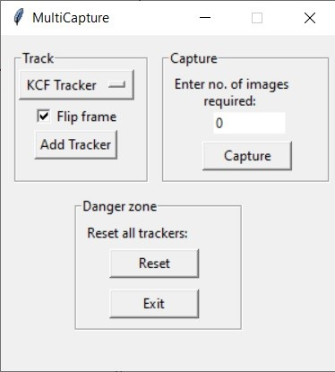

# MultiCapture
### Description
* Track and capture multiple objects in real time.

### Dependancies
* `opencv-python` - can be installed via `pip` or `conda`.

### Usage
* Choose your preferred tracker. Click add tracker.
* Frame will pause for you to select your Region of Interest(ROI) that you want to track.
* Press enter after selecting. It' ll start tracking the ROI.
* Keep adding trackers as required.
* Enter number of images you want of each ROI. Hit capture.
* Images captured can be found in `captures` directory.
